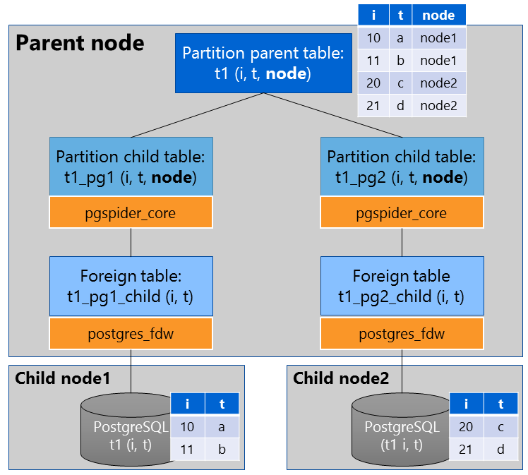

# PGSpider Extension
PGSpider Extension(pgspider_ext) is an extension to construct High-Performance SQL Cluster Engine for distributed big data.
pgspider_ext enables PostgreSQL to access a number of data sources using Foreign Data Wrapper(FDW) and retrieves the distributed data source vertically.  
Code of pgspider_ext is one of extension of PostgreSQL. We call PostgreSQL installed pgspider_ext as **"PGSpider"**.   
Usage of PostgreSQL installed pgspider_ext is the same as PostgreSQL. You can use any client applications such as libpq and psql.

## Features
* Node partitioned table  
    User can get records in multi tables on some data sources by one SQL easily.
	If there are tables with similar schema in each data source, PGSpider can view them as a single virtual table.  
    PGSpider run under Declarative Partitioning feature. Even if tables on data sources does not have a partition key, PGSpider creates a partition key automatically based on child node.  
	For example, tables on data sources have 2 column(i and t).
	Data on node1:
	<pre>
	SELECT * FROM t1_node1;
	  i | t
	----+---
	 10 | a
	 11 | b
	(2 rows)
	</pre>
	Data on node2:
	<pre>
	SELECT * FROM t1_node2;
	  i | t
	----+---
	 20 | c
	 21 | d
	(2 rows)
	</pre>
	If you create a partition table t1 using pgspider_ext from t1_node1 and t1_node2, the partitioned table has 3 columns (i, t and node). x is a column of partition key. You can distinguish data sources by column 'node'.  
	Query on PGSpider:
	<pre>
	  i | t | node
	----+---+-------
	 10 | a | node1
	 11 | b | node1
	 20 | c | node2
	 21 | d | node2
	(4 rows)
	</pre>	

* Parallel processing  
    When PGSpider executes query, PGSpider expands partitioned table to child tables and fetches results from child nodes in parallel. 

* Pushdown   
    WHERE clause and aggregation functions can be pushed down to child nodes.
    The shippability depends on child FDW.

## How to install pgspider_ext

The current version can work with PostgreSQL 13.2. 

Download PostgreSQL source code.
<pre>
https://www.postgresql.org/ftp/source/v13.2/postgresql-13.2.tar.gz
</pre>

Decompress PostgreSQL source code. 
<pre>
tar xvf postgresql-13.2.tar.gz
</pre>

Download pgspider_ext source code into "contrib/pgspider_ext" directory.
<pre>
git clone XXX 
</pre>

Build and install PostgreSQL and pgspider_ext.
<pre>
cd postgresql-13.2
./configure
make
sudo make install
cd contrib/pgspider_ext
make 
sudo make install
</pre>

## Usage
For example, there are 3 nodes (1 parent node and 2 child nodes).
PGSpider runs on the parent node. And 2 child nodes are data sources.
Each child node has PostgreSQL. They are accessed by PGSpider.  

Please install PostgreSQL on child nodes and install PostgreSQL FDW into PGSpider. 

Install PostgreSQL FDW 
<pre>
cd ../postgres_fdw
make 
sudo make install
</pre>

### Start PGSpider
You can start PGSpider as same as PostgreSQL. 
<pre>
/usr/local/pgsql
</pre>

Create database cluster and start server.
<pre>
cd /usr/local/pgsql/bin
./initdb -D ~/pgspider_db
./pg_ctl -D ~/pgspider_db start
</pre>

Connect to PGSpider.
<pre>
./psql postgres
</pre>

### Load extension
PGSpider(Parent node)
<pre>
CREATE EXTENSION pgspider_ext;
</pre>

PostgreSQL FDW
<pre>
CREATE EXTENSION postgres_fdw;
</pre>

### Create server
Create PGSpider server.
<pre>
CREATE SERVER spdsrv FOREIGN DATA WRAPPER pgspider_ext;
</pre>

Create servers of child PostgreSQL nodes  
<pre>
CREATE SERVER pgsrv1 FOREIGN DATA WRAPPER postgres_fdw OPTIONS(host '127.0.0.1', port '5433', dbname 'postgres');
CREATE SERVER pgsrv2 FOREIGN DATA WRAPPER postgres_fdw OPTIONS(host '127.0.0.1', port '5434', dbname 'postgres');
</pre>

### Create user mapping
Create user mapping for PGSpider server.
No need to specify options.
<pre>
CREATE USER MAPPING FOR CURRENT_USER SERVER spdsrv;
</pre>

User mapping for PostgreSQL servers.
<pre>
CREATE USER MAPPING FOR CURRENT_USER SERVER pgsrv1 OPTIONS(user 'user', password 'pass');
CREATE USER MAPPING FOR CURRENT_USER SERVER pgsrv2 OPTIONS(user 'user', password 'pass');
</pre>

### Create foreign tables
Create foreign tables of child nodes according to data source FDW usage.
In this example, each PostgreSQL server has table 't1' which has 2 columns ('i' and 't').
You can also create them by using IMPORT FOREIGN SCHEMA if data source FDW supports it.
<pre>
CREATE FOREIGN TABLE t1_pg1_child (i int, t text) SERVER pgsrv1 OPTIONS (table_name 't1');
CREATE FOREIGN TABLE t1_pg2_child (i int, t text) SERVER pgsrv2 OPTIONS (table_name 't1');
</pre>

### Create partition table
Create a partition parent table and partition child tables.
Partition child tables are corresponding to each foreign table created at the previous step.  
You need to declare a partition key column **at the last** in addition to columns of data source table.  

A partition parent table:  
In this example, we define 'node' column as a partition key column.
<pre>
CREATE TABLE t1(i int, t integer, node text) PARTITION BY LIST (node);
</pre>

Partition child tables:
<pre>
CREATE FOREIGN TABLE t1_pg1 PARTITION OF t1 FOR VALUES IN ('node1') SERVER spdsrv;
CREATE FOREIGN TABLE t1_pg2 PARTITION OF t1 FOR VALUES IN ('node2') SERVER spdsrv OPTIONS (child_name 't1_child2');
</pre>

't1_a' is corresponding to the foreign table 't1_pg1'.
PGSpider searches the corresponding foreign table by name having "[table name]_child" by default.
You can specify the name by the 'child_name' option.

### Access a partition table
<pre>
SELECT * FROM t1;
  i | t | node
----+---+-------
 10 | a | node1
 11 | b | node1
 20 | c | node2
 21 | d | node2
(4 rows)
</pre>

## Note
If you want to pushdown aggregate functions, you needs to execute:
<pre>
SET enable_partitionwise_aggregate TO on;
</pre>

We have confirmed that PGSpider can connect to:
- PostgreSQL ([postgres_fdw](https://github.com/postgres/postgres))
- MySQL ([mysql_fdw](https://github.com/pgspider/mysql_fdw))

## Contributing
Opening issues and pull requests on GitHub are welcome.

## License
Copyright and license information can be found in the
file [`License`][1] .

[1]: License
